# OSS Browser

OSS Browser 提供类似 windows 资源管理器功能。用户可以很方便的浏览文件，上传下载文件，支持断点续传等。

本工具使用开源框架 Angular 1.x + [Electron](http://electron.atom.io/)制作。

> Electron 框架可以让你使用 JavaScript，HTML 和 CSS 构建跨平台的桌面应用程序。它是基于 node.js 和 Chromium 开源项目。Electron 可以打包出跨平台的程序，运行在 Mac，Windows 和 Linux 上。

## 1. 支持平台

Windows7 above, Linux and Mac,不建议使用 windows XP 平台和 windows Server 平台

## 2. 客户端下载：

最新版本`1.9.5`，下载地址如下，解压即可使用。

> [<h4>Window x32 版下载</h4>](https://oss-attachment.cn-hangzhou.oss.aliyun-inc.com/oss-browser/1.9.5/oss-browser-win32-ia32.zip)

> [<h4>Window x64 版下载</h4>](https://oss-attachment.cn-hangzhou.oss.aliyun-inc.com/oss-browser/1.9.5/oss-browser-win32-x64.zip)

> [<h4>Mac zip 版下载</h4>](https://oss-attachment.cn-hangzhou.oss.aliyun-inc.com/oss-browser/1.9.5/oss-browser-darwin-x64.zip)

> [<h4>Ubuntu x64 版</h4>](https://oss-attachment.cn-hangzhou.oss.aliyun-inc.com/oss-browser/1.9.5/oss-browser-linux-x64.zip)

> [<h4>Ubuntu x32 版</h4>](https://oss-attachment.cn-hangzhou.oss.aliyun-inc.com/oss-browser/1.9.5/oss-browser-linux-ia32.zip)

其他版本暂不提供，可以自行 build。

> [所有版本下载](all-releases.md)

## 3. 功能介绍:

```
功能Map
  |-- 登录：支持AK登录和授权码登录。
  |-- Bucket管理，新建bucket，删除bucket，bucket权限修改，碎片管理。
       |-- 文件管理：目录（包括bucket）和文件的增删改查， 复制, 文件预览等。
             |-- 文件传输任务管理： 上传下载，断点续传。
  |-- 地址栏功能（支持oss://协议URL，浏览历史前进后退，保存书签）
  |-- 授权功能： 简化RAM Policy授权。
  |-- 生成授权码： STS临时授权。
```

### (1) [AK 登录](docs/aklogin.md)

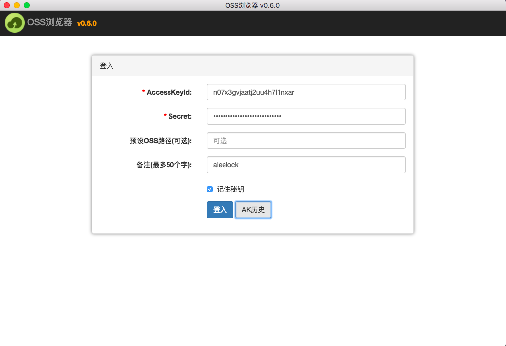

- 子用户登录可以指定预设 OSS 路径，配合子用户授权使用。

### (2) Bucket 列表

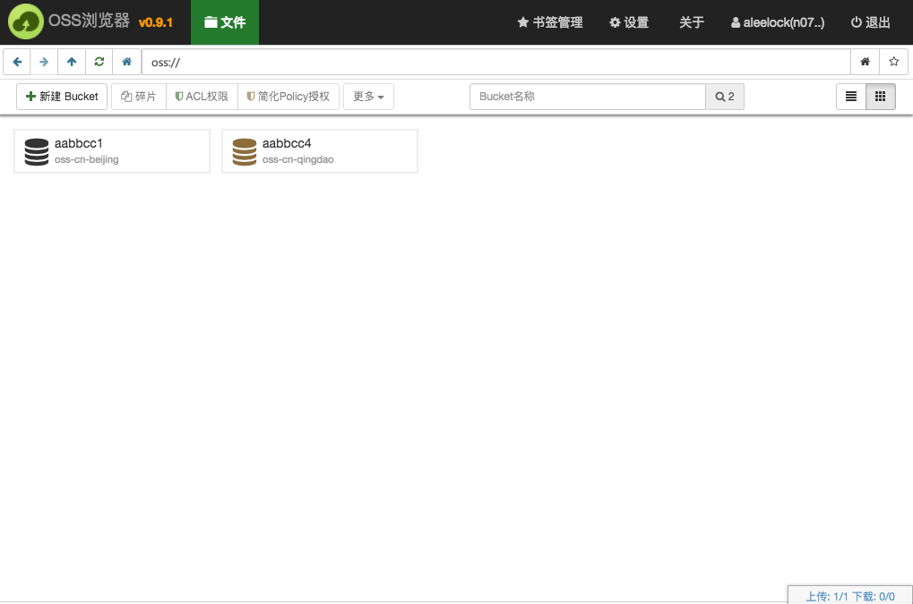

### (3) 文件列表 (支持拖拽上传)

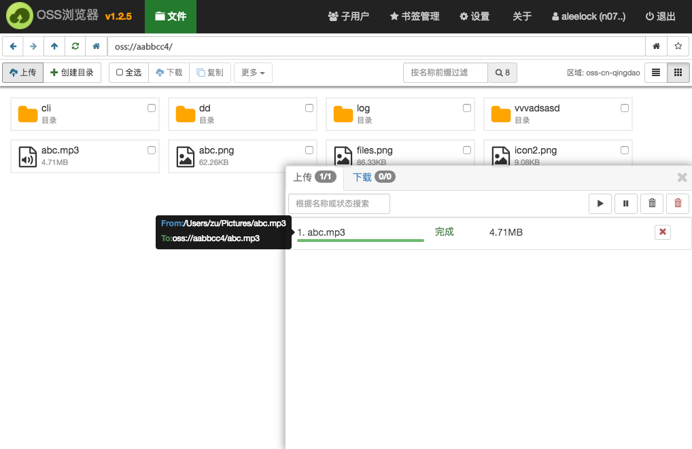

### (4) [授权给子用户 & 子用户登录](docs/aklogin.md)

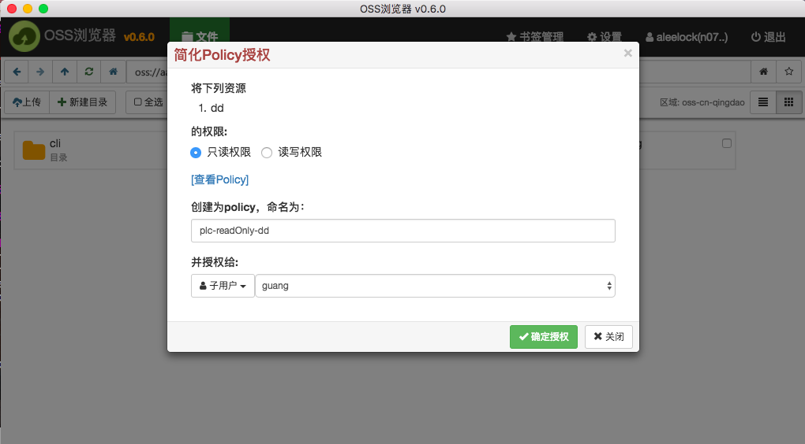

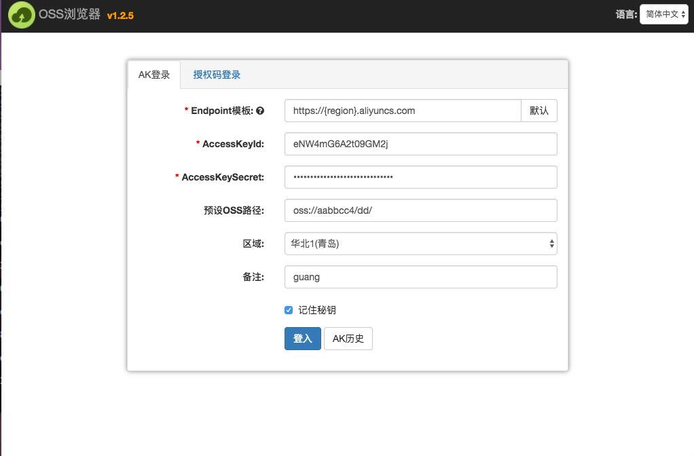

### (5) [临时授权 & 授权码登录](docs/authToken.md)

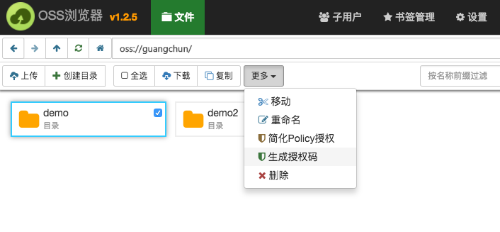

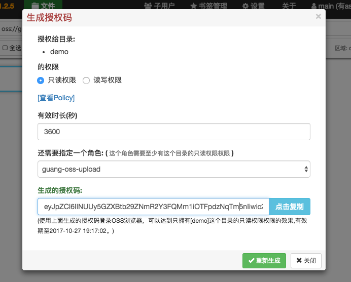

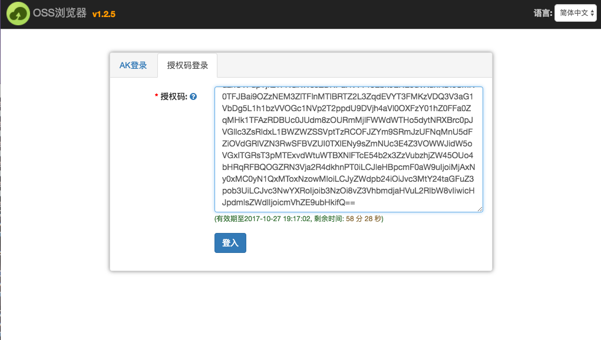

### (6) 归档 bucket 支持

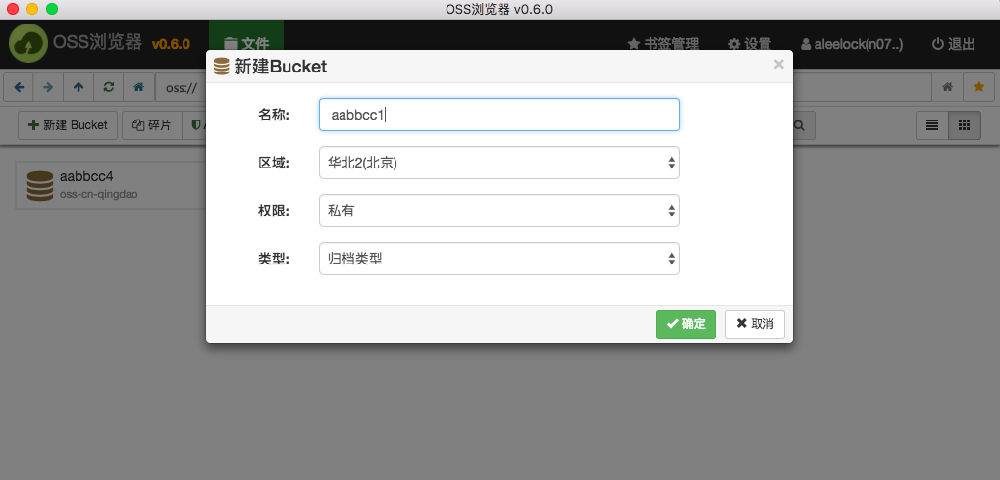

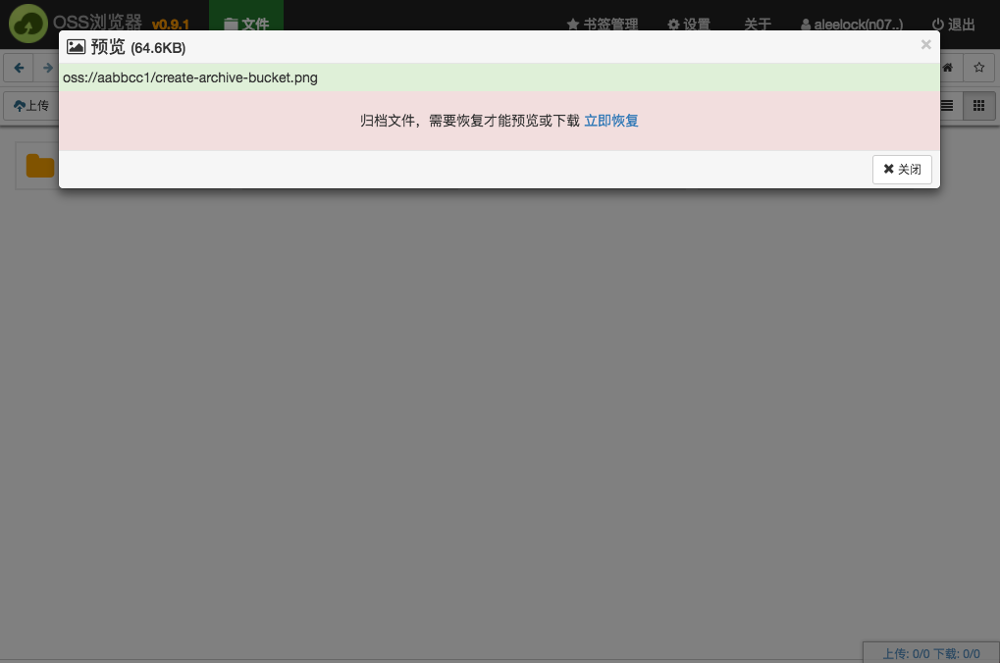

- 归档 bucket 下所有文件均为 Archive 存储类型, 需要解冻才能访问。

### (7) 支持自定义域名（cname 方式）访问（1.9.0 版本开始支持）

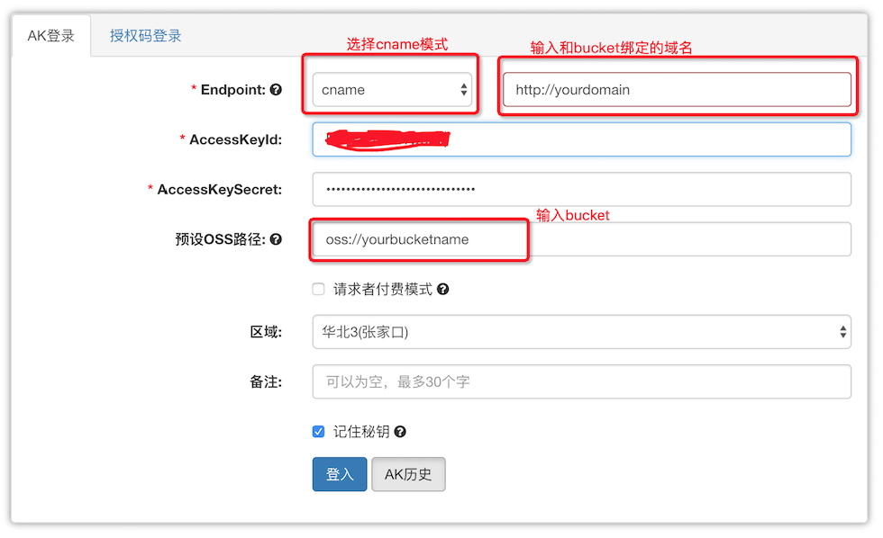

- cname 模式需要用户在 oss 控制台上进行域名和 bucket 的绑定，使用 cname 模式 ossbrowser 上所有 object 的操作都会走自定义域名方式

### (7) 支持请求付费者模式访问（1.9.0 版本开始支持）

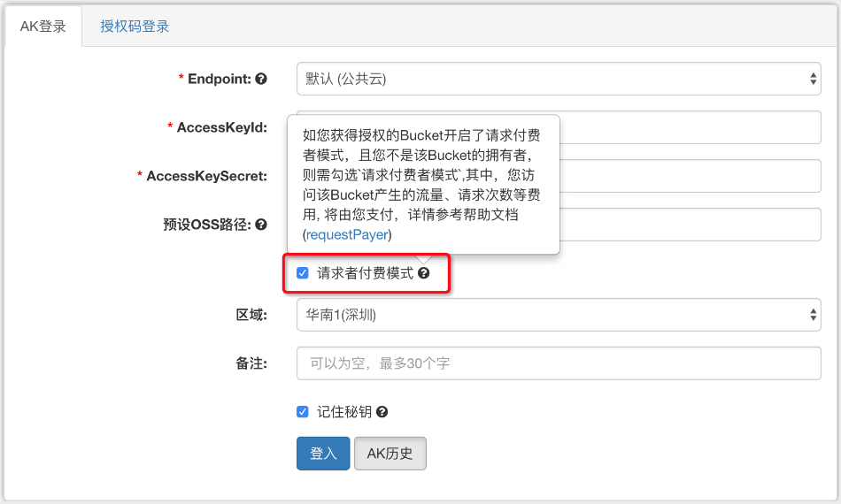

## 4. 开发环境搭建

> 如果你要在此基础上开发，请按照以下步骤进行。

### (1) 安装 node.js 最新版本

官网: https://nodejs.org/

### (2) 安装 cnpm

官网: https://cnpmjs.org/

cnpm 是 npm（node 包管理工具）的中国镜像，可以提高下载依赖包的效率。

### (3) 如果使用 windows 系统，需要安装下列软件：

- 需要安装 gitbash:

请自行下载安装。

- 需要安装 windows-build-tools:

```
cnpm i -g windows-build-tools
```

- 还需要下载 make.exe，放到 `C:\windows\` 目录下

[make.exe(64 位版本)](http://luogc.oss-cn-hangzhou.aliyuncs.com/oss-browser-publish/windows-tools/64/make.exe)

[make.exe(32 位版本)](http://luogc.oss-cn-hangzhou.aliyuncs.com/oss-browser-publish/windows-tools/32/make.exe)

### (4) 下载代码

```
git clone git@github.com:aliyun/oss-browser.git
```

安装依赖:

```
make i
```

### (5) 运行

```
make run  # 开发模式运行, command+option+i 可用打开调试界面, win或linux按 F12.
```

开发模式下，会自动监听源码,如有修改,会自动 build 前端代码到 dist 目录。

### (6) 打包

```
make build  # build前端代码到dist目录
```

```
make win64  # 打包win64程序， 可选: mac, linux64,linux32,win32,win64,all.
```

## 5. 代码结构

```
oss-browser/
 |-- app/                 # 前端代码, 采用angular1.x + bootstrap3.x
 |-- custom/              # 自定义图标，名称等。请看custom/Readme.md
 |-- node/                # 前端调用的 node 模块
     |-- crc64/           # crc校验模块，用来校验文件完整性
     |-- ossstore/        # 上传下载job类
     |-- i18n/            # 国际化
 |-- vendor/              # 前端 aliyun-sdk 依赖
 |-- node_modules         # node端依赖的模块
 |-- dist                 # 前端临时build出的代码
 |-- build                # electron build 出的应用
 |-- gulpfile.js          # 项目管理文件
 |-- package.json         # 项目描述文件
 |-- main.js              # 程序入口
```

## 6. 自定义 build

请看这里: [自定义 build](custom/)

## 7. 关于贡献

- 如有建议或发现 bug，请直接开 issue 或者提 PR，PR 必须 merge 请求到 dev 分支,我们会统一把 dev 分支合并到 master 并发布，感谢广大开发者参与。

## 8. 注意事项

- OSS Browser 使用过程中，如果遇到问题可打开调试面板进行问题初步排查，可通过单击 OSS Browser 工具左上角图标连续 10 次弹出调试面板,针对每个操作 OSS Browser 埋的都有关键操作信息，同时控制台会实时同步错误信息,如果用户无法理解错误日志信息。请 issue 截图反馈@luozhang002 进行排查
- OSS Browser 工具使用过程中尽量不要开本地代理或者 VPN 相关
- 开发者如果是通过本地编译 github 仓库生产的 oss browser 工具，想要进行主进程和渲染进程相关代码的调试可以参考文档[debug](debug.md)

## 9. 开源 LICENSE

[Apache License 2.0](LICENSE)
