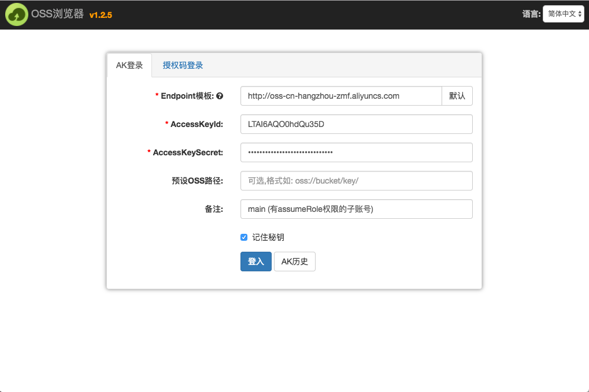
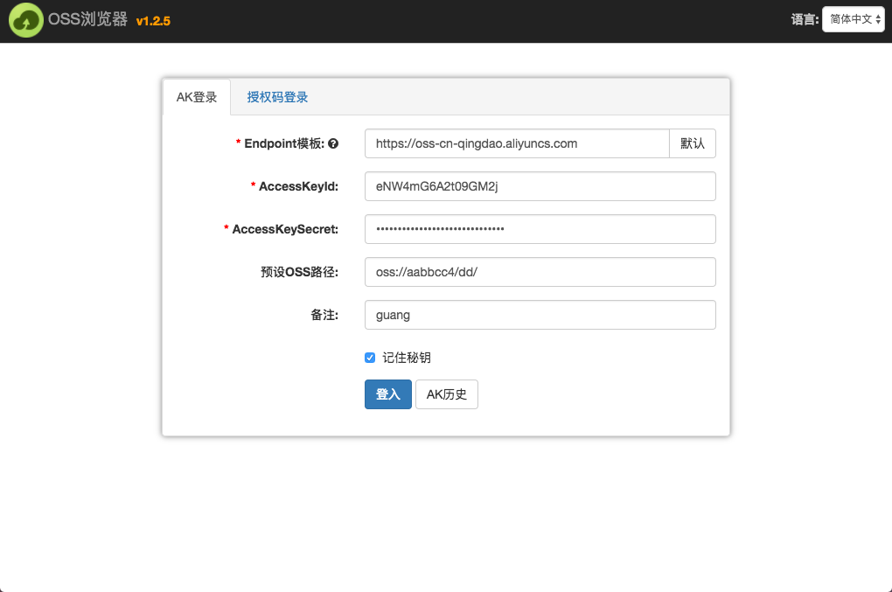

# Access Key-based logon

## 1. Logon using the Access Key of a subaccount with high-level privilege

- The primary account is not recommended for Access Key-based logon. A subaccount with high-level privilege is recommended.

- Go to the [RAM console](https://ram.console.aliyun.com) to create a subaccount Access Key.

- The subaccount must be assigned the "AliyunSTSAssumeRoleAccess" and "AliyunRAMReadOnlyAccess" permissions and the permission to access the directory to be authorized.

- Authorization of the subaccount with high-level privilege (recommended configuration for novice users):

(1) Example of logon to public cloud:

(2) Example of logon to private cloud:

2. Logon using a subaccount with low-level privilege

Assume that a subaccount is assigned the read or write permission on the `oss://aabbcc4/dd/` directory. The subaccount is considered to have low-level privilege. Logon using this subaccount is as follows:

Or:

