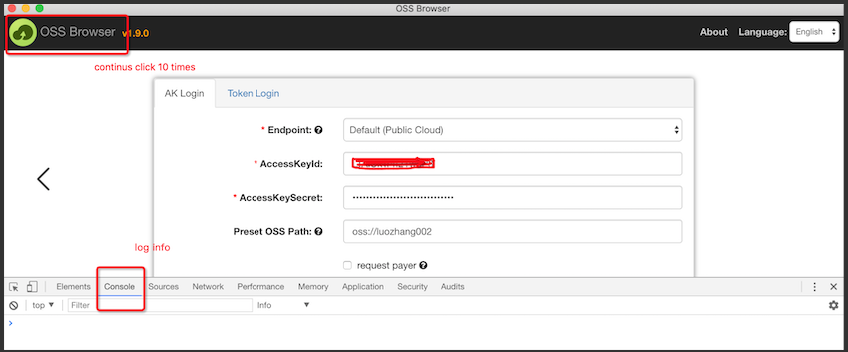
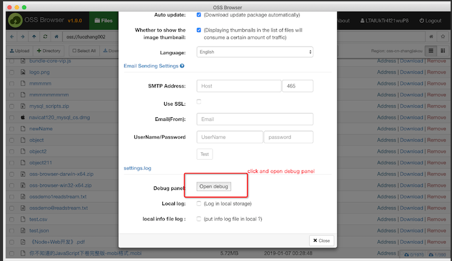
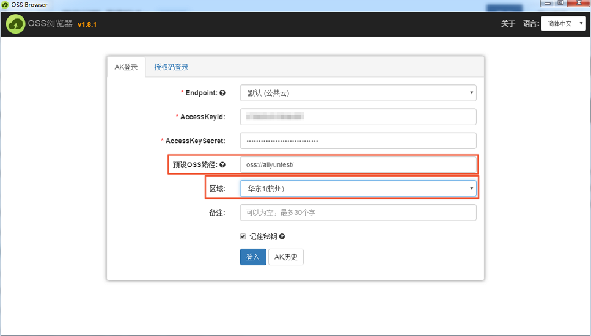
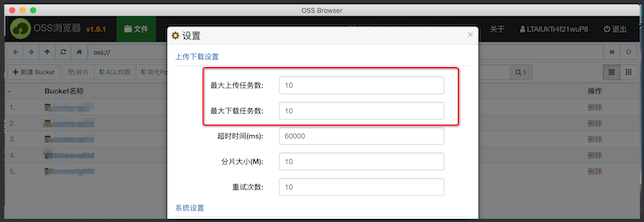
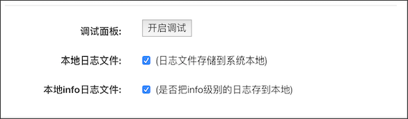
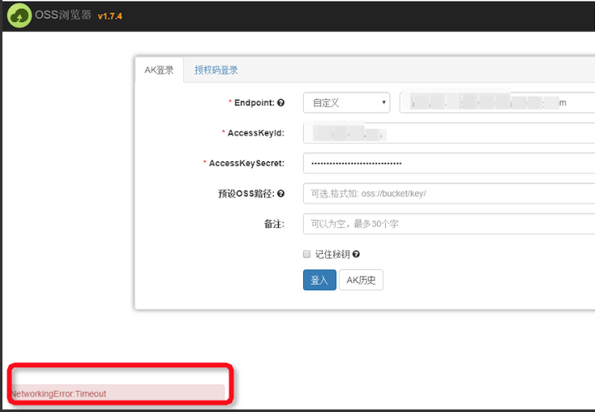

## OSSBrowser 常见问题(持续更新中)

#### ossbrowser 使用 QQ 邮箱发送邮件出现`535`错误

535 错误需要登录 QQ 客户端设置页面开启 smtp 服务和授权码，记住填写密码的

#### 如何打开 ossbrowser 的调试模式

- 单击左上角 Logo 连续 10 次

- ossbrowser 设置页面单击`打开调试`按钮

#### 使用 AK 登录时出现“AccessDenied:You are forbidden to list buckets.”报错

解决办法：

- 若您的账号无 Bucket 访问权限，请先添加访问权限，之后再登录。
- 若您的账号仅有部分 Bucket 或部分文件的访问权限，请在预设 OSS 路径栏添加访问路径，并选择 Bucket 所在区域。例如：某账号仅有名为 aliyuntest ，位于“华东 1（杭州）”的 Bucket 访问权限，则预设 OSS 路径应填写：oss://aliyuntest/，区域需选择“华东 1（杭州）”。

#### 调整上传下载过程中的任务数

打开 ossbrowser 设置页面，上传下载设置选项里可以设置最大上传任务数和最大下载任务数。

#### 如何打开 ossbrowser 本地日志功能

ossbrowser 默认日志存储位置如下：

on Linux: ~/.config/oss-browser/log.log

on OS X: ~/Library/Logs/oss-browser/log.log

on Windows: %USERPROFILE%\AppData\Roaming\oss-browser\log.log

OSSBrowser 设置界面提供设置开关，通过设置开关用户可以选择是否开启本地日志收集，默认只收集错误信息日志，同样也可以打开开关收集普通的 info 信息

#### 登录出现`NetworkingError`问题

针对这种问题首先排查本地网络 ping 下 enpoint 看能否 ping 通，其次排查本地有没有设置相关代理

#### ossbrowser 上传过程中支不支持断点续传

支持,文件上传一半的时候如果重启 OSSBrowser,单击开始上传，OSSBrowser 会从之前的记录点继续上传

#### ossbrowser 支持的平台

目前支持 Mac、linux 、Windows(7 及以上)，此外由于 windows server 环境过于复杂，不建议用户在 windows server 平台进行文件上传

#### windows 平台上传文件卡顿

windows 平台下，大量的文件上传确实容易导致卡顿，甚至有时候无法上传。这里提出一些建议：

1. 建议分批上传
2. 上传过程中建议不要做其他操作
3. 可以把最大上传任务数和分片大小调小

#### 使用过程中遇到任何问题，上传、下载、删除等

打开调试模式或者开启本地日志收集功能，把相关日志信息粘贴到[github issue](https://github.com/aliyun/oss-browser/issues)里，会有相关工程师跟进。

#### 目前 ossbrowser 重命名文件大小有限制

目前支持 1G

#### ossbrowser 暂时目前支持的文档预览格式

txt 、pdf 等，暂不支持 doc、docx、ppt 等

#### ossbrowser 支持上传的文件最大是多少

ossbrowser 本身只是一个上传工具，上传调用的是 SDK，上传的最大文件取决于 OSS 底层支持的最大文件，单个文件最大是 48.8TB

#### ossbrowser 删除 bucket 删除不了

请确保该 bucket 下的碎片和内容已经清空，然后才能删除

#### 如果一个 bucket 已经开通 reqeustPay 功能，如何访问

首页登录页：路径里填写指定的 bucket，同时勾选 requesterPay 选项

#### ossbrowser 自定义域名绑定功能如何使用

登录界面中 Endpoint 切换到 cname 选项，同时 input 域中输入域名，预设 oss 路径中输入对应的 bucket,确保 bucket 和域名已经绑定

### 使用过程中遇到的任何问题和经验都可以同步到常见问题专栏里
